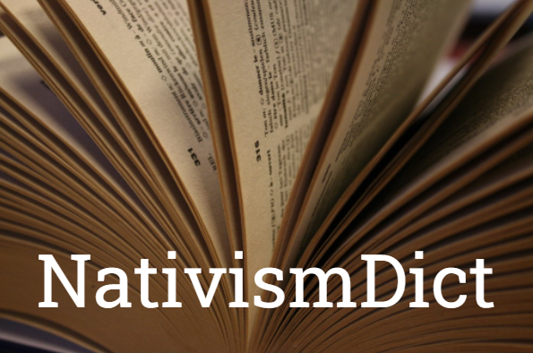

Nativism Dictionary
===============


[](https://twitter.com/FabianHabersack)


# Description

This repository makes the German-language nativism dictionary freely available that was established, validated, and used for the following research article:

> **Habersack, FJ, and Werner, A (2023).** How non-radical right parties strategically use nativist language: Evidence from an automated content analysis of Austrian, German, and Swiss election manifestos, _Party Politics_, 29(5), 865-877. DOI: [10.1177/13540688221103930](https://doi.org/10.1177/13540688221103930)

The dictionary is intended and designed for use in quantitative text analyses of political texts, such as parties' election manifestos. It measures nativist language on a (quasi)sentence basis (see: [MARPOR](https://manifesto-project.wzb.eu)) using RegEx patterns (string-of-words). The dictionary not only identifies sentences as nativist (binary) but also allows measuring nativism along five components or sub-dimensions:
  
- **Cultural dimension:** ‘Does the quasi-sentence indicate language that refers to one’s own(ed) traditions and one’s own(ed) cultural values or achievements, that sees these values threatened and that thereby expresses a single narrative of belonging?’
- **Political rights dimensions:** ‘Does the quasi-sentence reflect language from which a general hostility toward seemingly non-indigenous groups or actors emerges and as a result of which expresses concern with an infringement of political self-determination rights?’
- **Religious dimension:** ‘Does the quasi-sentence exhibit language that conceives of non-native religious influences such as Islam as alien and incompatible with other religious values such as Christianity?’.
- **Economic dimension:** ‘Does the quasi-sentence exhibit language from which an economic threat situation emerges that is caused or exacerbated by non-nativist actors or groups?’
- **Law and order dimension:** ‘Does the quasi-sentence exhibit language that refers to security threats such as rising crime as a result of non-nativist, foreign influences?’

**NOTE:** When the dictionary is applied to new, unseen data, especially if these are document types other than pre-structured election manifestos, additional validation is required. The dictionary has been validated on Austrian, German, and Swiss election manifestos and reliably measures nativist ideology. If inaccuracies are found with respect to other document types, please let me know.

# Using the Nativism Dictionary

To use the dictionary for quantitative text analyses in R, install and load the package {quanteda}.

```r
install.packages("quanteda")
library(quanteda)
```

To use the dictionary (_Nativism Dictionary 1.0_), please import the raw dictionary terms contained in the file [nativism_dict.RDS](nativism_dict.RDS).

```r
nativism_dict <- readRDS("nativism_dict.RDS")
nativism_dict
```
```r
Dictionary object with 5 key entries.
- [cultural_dim]: ...
- [political_rights_dim]: ...
- [religious_dim]: ...
- [economic_dim]: ...
- [law_and_order_dim]: ...
```

Focus only on _individual components_ of nativism, e.g. its economic dimension (that is, _welfare chauvinism_), like so:

```r
nativism_dict[4]
```
Or, alternatively:
```r
nativism_dict[c("economic_dim")]
```

# Citation

If you use the Nativism Dictionary, please cite:

- Habersack FJ (2022). NativismDict. A regular expression dictionary for quantitative text analyses, available on GitHub. <br />
  DOI: [10.5281/zenodo.6598960](https://doi.org/10.5281/zenodo.6598960). [&#8594; BibTeX](cite/Habersack2022.bib)

and

- Habersack, FJ, and Werner, A (2023). How non-radical right parties strategically use nativist language: Evidence from an automated content analysis of Austrian, German, and Swiss election manifestos, _Party Politics_, 29(5), 865-877.  <br />
  DOI: [10.1177/13540688221103930](https://doi.org/10.1177/13540688221103930). [&#8594; BibTeX](cite/HabersackWerner2022.bib)

Cheers!
